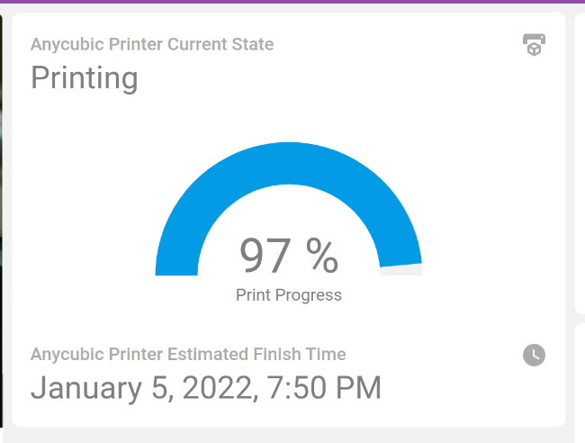

[](https://github.com/sopelj/hass-anycubic-printer-component/releases)
[](LICENSE.md)
[](https://github.com/custom-components/hacs)


# Custom integration for Wi-Fi enabled Anycubic 3D Printers for Home Assistant.

Custom integration to connect to the Anycubic 3D Printers that support their app.
Only just started working on this, but seem to be able to obtain some information.

*Note*: I have only tested it with the Photon Mono SE. Technically should work with other resin printers that support the app. 
I have no FDM printers from Anycubic to test with though, so I'm not sure what they return. 

Tested With:
 - Photon Mono SE


## Installation

Add to HACS as custom repository:

<https://github.com/sopelj/hass-anycubic-printer-component>

And then add to your configuration.yaml and add sensors for your mug(s):

### Config Flow

- Go into Settings -> Devices 
- Choose "Add Integration"
- Search for "Anycubic"
- Enter the IP address and port (default is 6000) of your printer and hit next

## Usage

Quick example for usage in lovelace



```yaml
- type: vertical-stack
  cards:
    - type: entity
      entity: sensor.anycubic_current_state
    - type: conditional
      conditions:
        - entity: sensor.anycubic_current_state
          state_not: Stopped
      card:
        type: gauge
        entity: sensor.anycubic_job_percentage
        min: 0
        max: 100
        name: Print Progress
    - type: conditional
      conditions:
        - entity: sensor.anycubic_current_state
          state: Printing
      card:
        type: entity
        entity: sensor.anycubic_estimated_finish_time
```